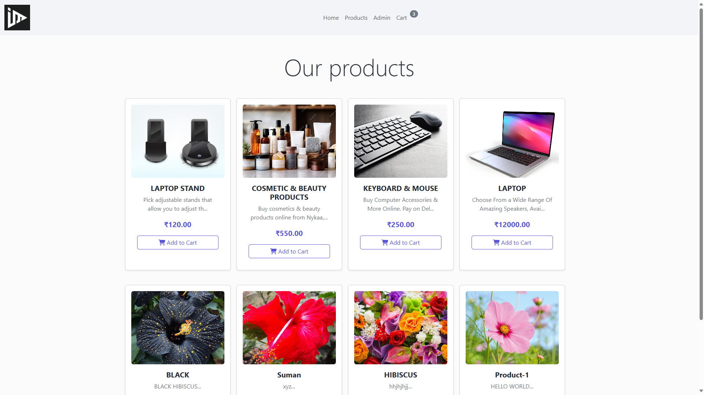
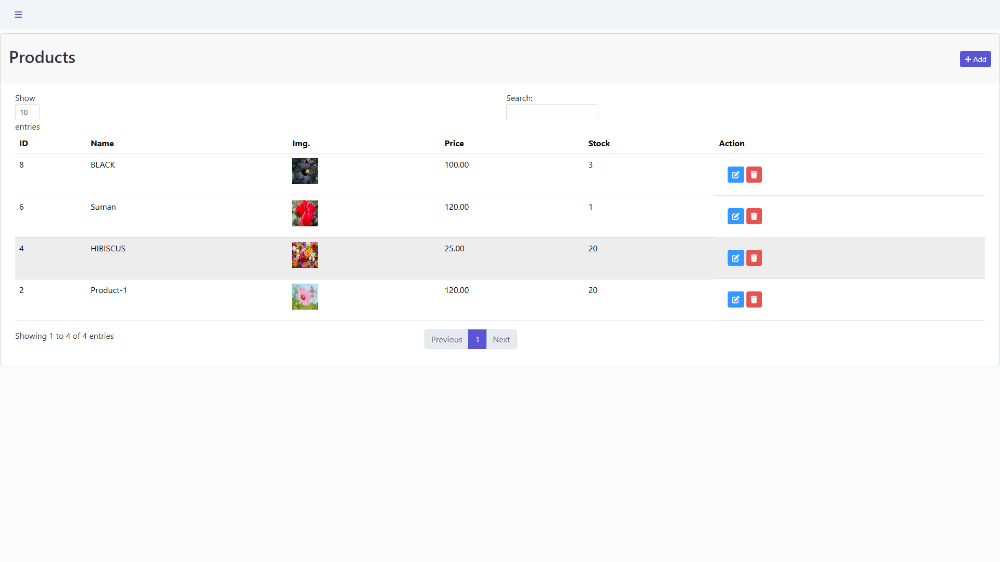
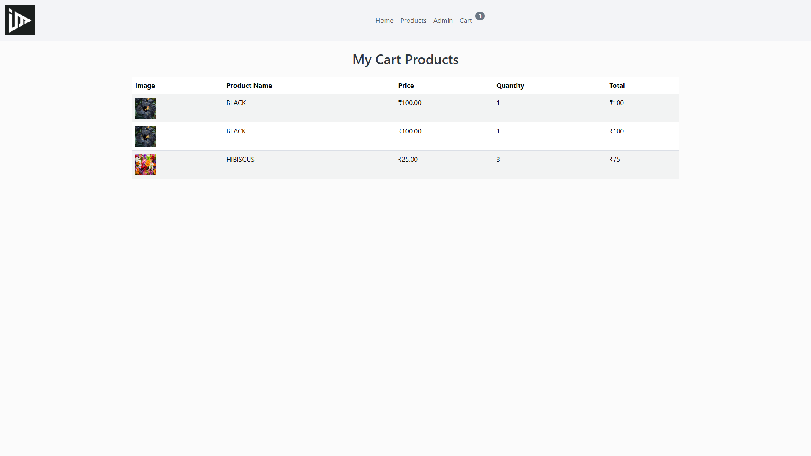
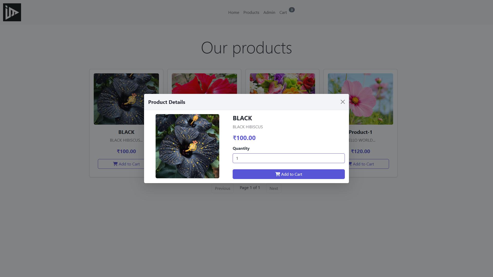
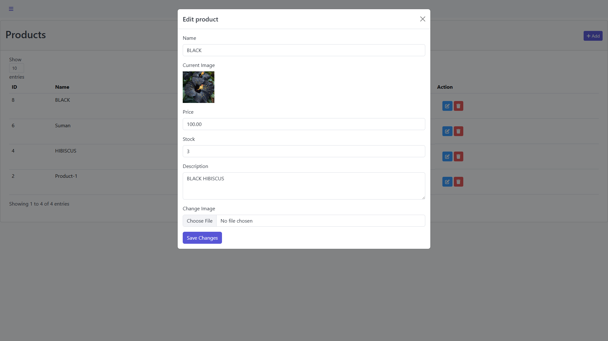

# 🛒 Shopping Cart Project (Core PHP)

## 📖 Overview
This is a **complete Shopping Cart project** built using **Core PHP and AJAX**. The system allows users to **browse products, add them to the cart, and manage them dynamically**. Admins can **create, update, delete, and manage products** from the backend using AJAX without refreshing the page.

## ✨ Features
### 🔹 **Frontend**
- View **products dynamically** fetched from the backend.
- Add **products to the cart** without refreshing the page.
- **Product details modal** for quick preview.
- **Shopping cart page** to manage cart items.

### 🔹 **Backend (Admin Panel)**
- **CRUD Operations** (Create, Read, Update, Delete) for products using AJAX.
- Secure **Admin Login** system.
- Dynamic **product management dashboard**.
- **AJAX-based operations** (no page reloads).

## 📷 Screenshots
| Page | Screenshot |
|------|-----------|
| 🏠 **Index Page** |  |
| 🛍️ **Frontend Product Page** |  |
| 🔐 **Admin Login Page** |  |
| ⚙️ **Backend Product Management** |  |
| 🛒 **Cart Page** |  |
| 🔍 **Product View Modal** |  |
| 🛍️ **Backend Edit Page** |  |

> 📌 **Note:** Add screenshots in the `screenshots/` folder in your project and update the paths accordingly.

## 🔧 Technologies Used
- **PHP (Core PHP)**
- **AJAX & jQuery**
- **Bootstrap (for UI)**
- **COREUI (for UI)**
- **MySQL (Database)**
- **HTML, CSS, JavaScript**

## 🚀 Future Enhancements
🔹 **User Authentication** - Allow users to register and login.  
🔹 **User-Specific Carts** - Each logged-in user will have their own cart.  
🔹 **Cart Preview** - Show a live cart preview before adding items.  
🔹 **CRUD for Cart Items** - Users can update or delete specific cart items.  
🔹 **Checkout System** - Implement a payment gateway for orders.  

## 📜 Installation Guide
1. Clone the repository:  
   ```bash
   git clone https://github.com/your-username/shopping-cart.git
